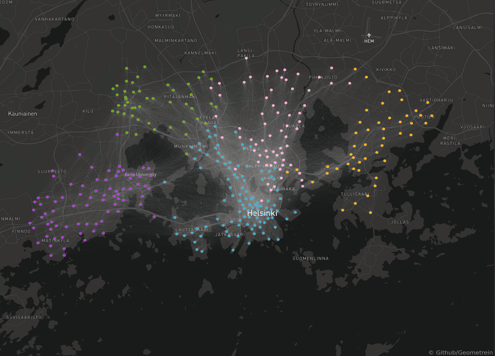

# Helsinki City Bikes

## **About**

This repository contains the code necessary to scrape, format and anlayze the publicly available data on Helsinki City Bike network.

---

## **What are Helsinki City bikes?**

- "Helsinki City Bikes" is a public bicycle system in Helsinki and Espoo and integrating with the rest of the public transport in Helsinki since May 2016. Its aim is to solve the so called [last mile problem](https://en.wikipedia.org/wiki/Last_mile_(transportation)).

- "Helsinki City Bikes" is operated as a public-private partnership between Helsinki Regional Transport Authority (HSL), Helsinki City Transport (HKL), Espoo Technical and Environment Services, Moventia and Smoove.

- City bikes are shared bicycles available to everyone in Helsinki or Espoo. You can purchase access to city bikes for a day, week or the entire cycling season. All passes include an unlimited number of 30-minute bike rides. For a small extra fee, you can use the bike for longer, five hours at most. After use, the bike is returned to a bike station. You can register as a city bike user on the HSL city bikes webpage. A day pass user can get access to 1–4 bikes; other passes only include one bike.

- There are 3,510 bikes in season 2020. Helsinki has 241 and Espoo 110 bike stations.

## **Getting started?**

### **Dependencies**
For more details see the "requirments.txt".

Quick install:
```
pip install -r requirements.txt
```

### **Files**

- **scraper.py** is used for scraping O-D dataset for a given year, station names and coordinates.

- **cleaner.py** is used to clean and format the data.

- **constants.py** Contains a dictionary with renamed stations their old and new names. It is used by cleaner to modify stations names in the main dataset.
- **main.py** is the main script that utilizes the other files.

Start by running the main file.

---

## **The Dataset**
**Scraped and formatted dataset can be found here: [Link to Kaggle](https://www.kaggle.com/geometrein/helsinki-city-bikes)**

---
## **Structure**
| departure           | return              | departure_id | departure_name  | return_id | return_name    | distance (m) | duration (sec.) | avg_speed (km/h)   | departure_coordinates                   | return_coordinates       | Air temperature (degC) |
|---------------------|---------------------|--------------|-----------------|-----------|----------------|--------------|-----------------|--------------------|-----------------------------------------|--------------------------|------------------------|
| 2020-03-23 07:43:51 | 2020-03-23 07:52:50 | 207          | Vanha Viertotie | 90.0      | Paciuksenkaari | 2409.0       | 534.0           | 0.2706741573033708 | (60.21107529627341, 24.881660254358646) | (60.1944475, 24.8911179) | 1.1                    |

---


## **Data Sources**
- The origin-destination dataset was downloaded from [HSL Open Data portal](https://www.hsl.fi/en/hsl/open-data).

- Weather data was gathered from [Finnish Meteorological Institute](https://en.ilmatieteenlaitos.fi/download-observations).
- Bike Station Coordinates are scraped from [Digitransit](https://api.digitransit.fi/routing/v1/routers/hsl/bike_rental).
---